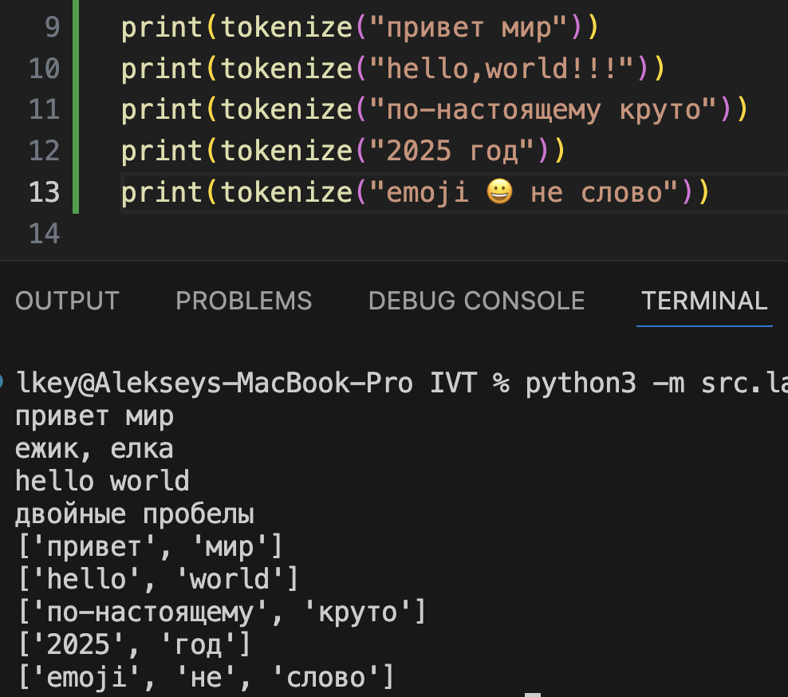

## Лабораторная работа 3

### Задание A
```python
def normalize(text: str, *, casefold: bool = True, yo2e: bool = True) -> str:
    """
    Нормализация текста:
        - приводит к нижнему регистру (если casefold=True)
        - заменяет 'ё' → 'е' и 'Ё' → 'Е' (если yo2e=True)
        - заменяет символы табуляции, перевода строки и возврата каретки на пробел
        - сжимает последовательности пробелов до одного
        - удаляет пробелы в начале и конце строки

    Примеры:
        - "ПрИвЕт\nМИр\t" → "привет мир" (casefold + схлопнуть пробелы)
        - "ёжик, Ёлка" (yo2e=True) → "ежик, елка"
        - "Hello\r\nWorld" → "hello world"
        - "  двойные   пробелы  " → "двойные пробелы"
    """

    if casefold:
        text = text.casefold()
    if yo2e:
        text = text.replace("ё", "е").replace("Ё", "Е")

    text = text.replace("\t", " ").replace("\r", " ").replace("\n", " ")

    while "  " in text:
        text = text.replace(" " * 2, " ")

    return text.strip()
```


```python
def tokenize(text: str) -> list[str]:
    """
    Разбиение текста на токены (слова):
    - словом считается последовательность символов \w (буквы, цифры, подчёркивание)
    - допускается наличие дефиса внутри слова (например, 'по-настоящему')
    - числа также считаются словами
    - разделителями считаются все небуквенно-цифровые символы (пробелы, пунктуация, эмодзи и т.п.)

    Примечание:
        \w = [A-Za-zА-Яа-я0-9_]
        (?:-\w+)* - означает «ноль или больше фрагментов
        вида - + слово» (hello-world-2025)

    Примеры:
        "привет мир" → ["привет", "мир"]
        "hello,world!!!" → ["hello", "world"]
        "по-настоящему круто" → ["по-настоящему", "круто"]
        "2025 год" → ["2025", "год"]
        "emoji 😀 не слово" → ["emoji", "не", "слово"]
    """

    tokens = finditer(pattern=r"\w+(-\w+)*", string=text)

    return [i.group() for i in tokens]
```


```python
def count_freq(tokens: list[str]) -> dict[str, int]:
    """
    Подсчёт частоты встречаемости токенов.
    На вход подаётся список токенов (строк).
    На выходе возвращается словарь {токен: количество}.

    Примеры:
        - ["a","b","a","c","b","a"] → частоты {"a":3,"b":2,"c":1};
        - При равенстве частот: токены ["bb","aa","bb","aa","cc"] →
        частоты {"aa":2,"bb":2,"cc":1};

    """

    counts = {}

    for i in tokens:
        if i in counts:
            counts[i] += 1
        else:
            counts[i] = 1

    return counts

def top_n(freq: dict[str, int], n: int = 5) -> list[tuple[str, int]]:
    """
    Выборка топ-N наиболее частых токенов.
    - сортировка по убыванию частоты
    - при равной частоте сортировка лексикографическая (по алфавиту)
    - возвращает список кортежей (токен, частота)

    Примеры:
        - top_n(..., n=2) → [("a",3), ("b",2)]
        - top_n(..., n=2) → [("aa",2), ("bb",2)]
        (алфавитная сортировка при равенстве).
    """

    freq = sorted(freq.items(), key=lambda item: [-item[1], item[0]])
    top_n = []

    for i in range(min(n, len(freq))):
        top_n.append((freq[i][0], freq[i][1]))

    return top_n
```


### Задание B
```python

def table(title: str, description: str, top: list[tuple[str, int]]) -> None:
    max_word_length = max([len(i[0]) for i in top]) + 1

    print(f"{title}{(max_word_length - 5) * ' '}| {description}")
    print("-" * (max_word_length + 2 + max_word_length))
    for i in top:
        word, count = i
        print(f"{word}{(max_word_length - len(word)) * ' '}| {count}")

"""
Функции:
    - Считает общее количество слов
    - Считает количество уникальных слов
    - Находит топ-5 наиболее частых слов

Токенизация и нормализация текста выполняются с помощью функций из src.lib.text:
    - normalize() — нормализует текст (нижний регистр, убирает лишние пробелы и заменяет 'ё' на 'е')
    - tokenize() — разбивает текст на слова/числа
    - count_freq() — считает частоты слов
    - top_n() — возвращает топ-N наиболее частых слов

Запуск:
    Из корня проекта:
        python3 -m src.lab03.text_stats < src/lab03/input.txt

Переменные:
    IS_TABLE — если True, выводится красивая таблица; иначе простая печать токен:частота
"""

IS_TABLE = True

text = sys.stdin.read()

text = normalize(text=text)

tokens = tokenize(text=text)

top = top_n(count_freq(tokens=tokens), n=5)

print(f"Всего слов: {len(tokens)}")
print(f"Уникальных слов: {len(set(tokens))}")
print("Топ-5:")

if IS_TABLE:
    table(title="cлово", description="частота", top=top)
else:
    for i in top:
        print(f"{i[0]}:{i[1]}")
```
