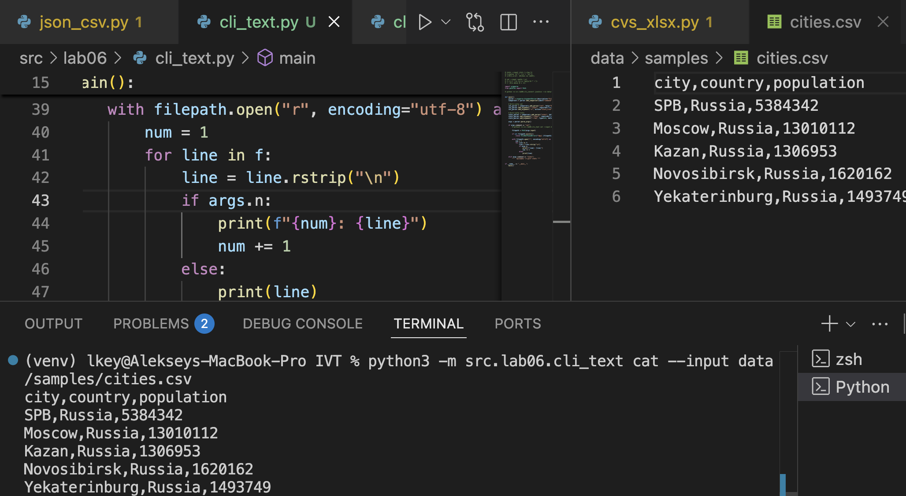
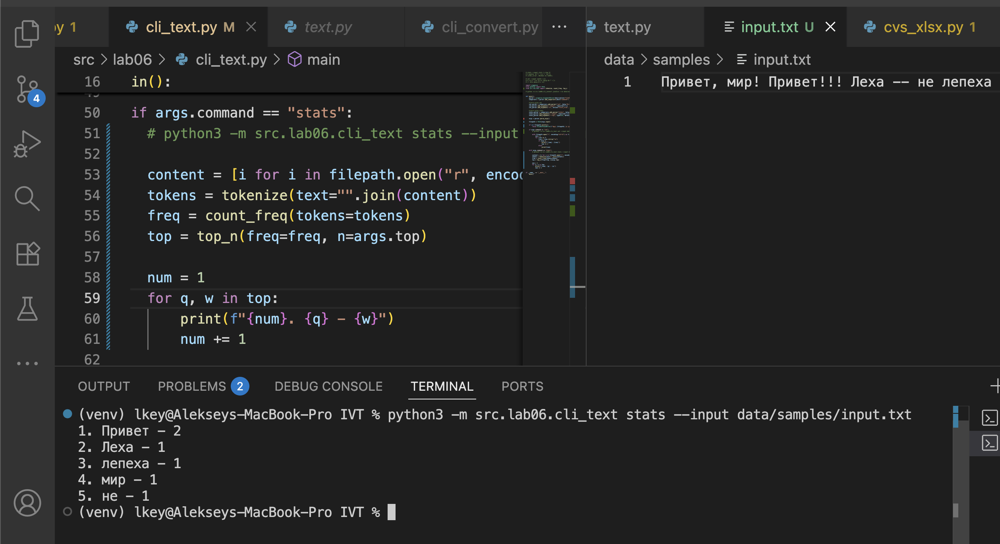
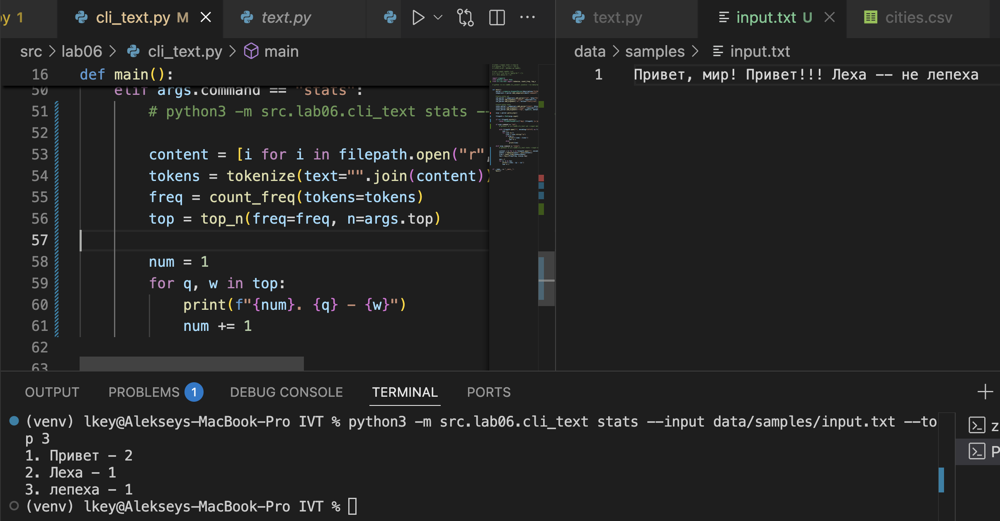
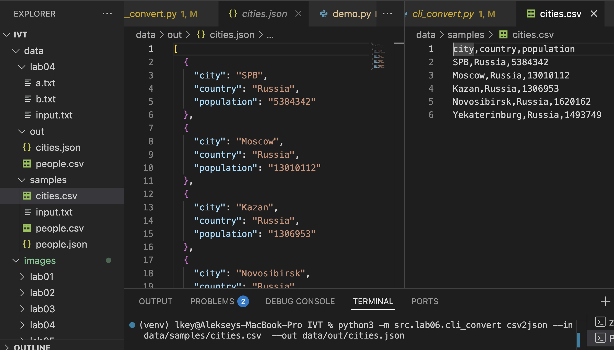
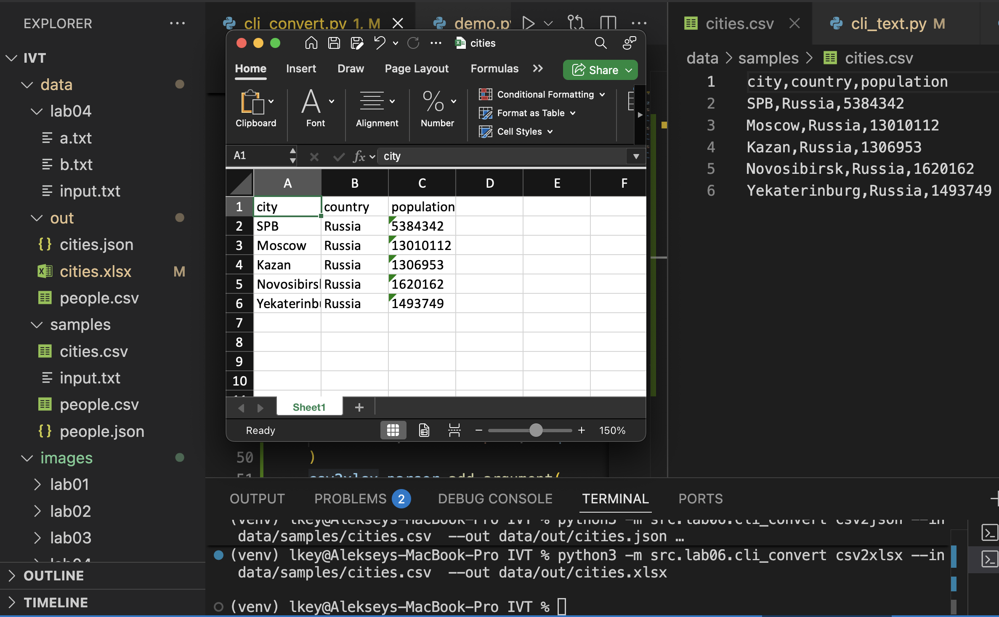

## Лабораторная работа 6

### Задание 1

```python
import argparse
from pathlib import Path
from src.lib.text import tokenize, count_freq, top_n


def main():
    """
    Точка входа для CLI-утилиты лабораторной работы №6 (текстовые инструменты).

    Назначение:
        Предоставляет две подкоманды:
        1. cat   — вывод содержимого текстового файла (с нумерацией строк при флаге -n);
        2. stats — анализ частот встречаемости слов в тексте.

    Подкоманды:
        cat --input <path> [-n]
            Выводит содержимое файла построчно.
            При указании флага -n добавляет нумерацию строк.

        stats --input <path> [--top N]
            Подсчитывает частоты слов в тексте, выводит N наиболее частых.
            Использует функции из модуля src.lib.text:
                - tokenize(text)
                - count_freq(tokens)
                - top_n(freq, n)

    Примеры:
        python3 -m src.lab06.cli_text cat --input data/samples/cities.csv -n
        python3 -m src.lab06.cli_text stats --input data/samples/input.txt --top 3

    Исключения:
        FileNotFoundError — если указанный файл не найден.
        ValueError — если текст пустой или содержит некорректные данные.
    """

    parser = argparse.ArgumentParser(description="CLI-утилиты лабораторной №6")
    subparsers = parser.add_subparsers(dest="command")

    # --- cat ---
    cat_parser = subparsers.add_parser("cat", help="Вывести содержимое файла")
    cat_parser.add_argument("--input", required=True, help="Путь к входному файлу")
    cat_parser.add_argument("-n", action="store_true", help="Нумеровать строки")

    # --- stats ---
    stats_parser = subparsers.add_parser("stats", help="Частоты слов в тексте")
    stats_parser.add_argument("--input", required=True, help="Путь к текстовому файлу")
    stats_parser.add_argument(
        "--top", type=int, default=5, help="Количество наиболее частых слов"
    )

    args = parser.parse_args()

    filepath = Path(args.input)

    if not filepath.exists():
        raise FileNotFoundError(f"Файл {filepath} не найден")

    if args.command == "cat":
        # python3 -m src.lab06.cli_text cat --input data/samples/cities.csv -n

        with filepath.open("r", encoding="utf-8") as f:
            num = 1
            for line in f:
                line = line.rstrip("\n")
                if args.n:
                    print(f"{num}: {line}")
                    num += 1
                else:
                    print(line)

    elif args.command == "stats":
        # python3 -m src.lab06.cli_text stats --input data/samples/input.txt --top 3

        content = [i for i in filepath.open("r", encoding="utf-8")]
        tokens = tokenize(text="".join(content))
        freq = count_freq(tokens=tokens)
        top = top_n(freq=freq, n=args.top)

        num = 1
        for q, w in top:
            print(f"{num}. {q} - {w}")
            num += 1


if __name__ == "__main__":
    main()
```








### Задание 2

```python

import argparse
from src.lib.json_csv import json_to_csv, csv_to_json
from src.lib.cvs_xlsx import csv_to_xlsx


def main():
    """
    Точка входа для CLI-утилиты лабораторной работы №6.

    Назначение:
        Предоставляет интерфейс командной строки для конвертации файлов между форматами:
        JSON ↔ CSV и CSV → XLSX.

    Подкоманды:
        json2csv — конвертировать JSON в CSV
        csv2json — конвертировать CSV в JSON
        csv2xlsx — конвертировать CSV в XLSX

    Примеры:
        python3 -m src.lab06.cli_convert json2csv --in data/samples/people.json --out data/out/people.csv
        python3 -m src.lab06.cli_convert csv2json --in data/out/people.csv --out data/out/people.json
        python3 -m src.lab06.cli_convert csv2xlsx --in data/out/people.csv --out data/out/people.xlsx

    Исключения:
        FileNotFoundError — если указанный входной файл не существует.
        ValueError — если структура входных данных некорректна.
    """

    parser = argparse.ArgumentParser(description="CLI-утилиты лабораторной №6")
    subparsers = parser.add_subparsers(dest="command")

    # --- json2csv ---
    json2csv_parser = subparsers.add_parser(
        "json2csv", help="Конвертировать JSON в CSV"
    )
    json2csv_parser.add_argument(
        "--in", dest="input", required=True, help="Путь к JSON-файлу"
    )
    json2csv_parser.add_argument(
        "--out", dest="output", required=True, help="Путь для CSV-файла"
    )

    # --- csv2json ---
    csv2json_parser = subparsers.add_parser(
        "csv2json", help="Конвертировать CSV в JSON"
    )
    csv2json_parser.add_argument(
        "--in", dest="input", required=True, help="Путь к CSV-файлу"
    )
    csv2json_parser.add_argument(
        "--out", dest="output", required=True, help="Путь для JSON-файла"
    )

    # --- csv2xlsx ---
    csv2xlsx_parser = subparsers.add_parser(
        "csv2xlsx", help="Конвертировать CSV в XLSX"
    )
    csv2xlsx_parser.add_argument(
        "--in", dest="input", required=True, help="Путь к CSV-файлу"
    )
    csv2xlsx_parser.add_argument(
        "--out", dest="output", required=True, help="Путь для XLSX-файла"
    )

    args = parser.parse_args()

    # --- Выполнение выбранной команды ---
    if args.command == "json2csv":
        json_to_csv(
            json_path=args.input,
            csv_path=args.output,
        )

    elif args.command == "csv2json":
        csv_to_json(
            csv_path=args.input,
            json_path=args.output,
        )

    elif args.command == "csv2xlsx":
        csv_to_xlsx(
            csv_path=args.input,
            xlsx_path=args.output,
        )


if __name__ == "__main__":
    main()
```




