## Лабораторная работа 1

### Задание 1
```python
name = input("Имя: ")
age = int(input("Возраст: "))
print(f"Привет, {name}! Через год тебе будет {age + 1}.")
```


### Задание 2
```python
a = float(input("A: ").replace(",", "."))
b = float(input("B: ").replace(",", "."))

print(f"sum={a + b}; avg={(a + b) / 2:.2f}")
```
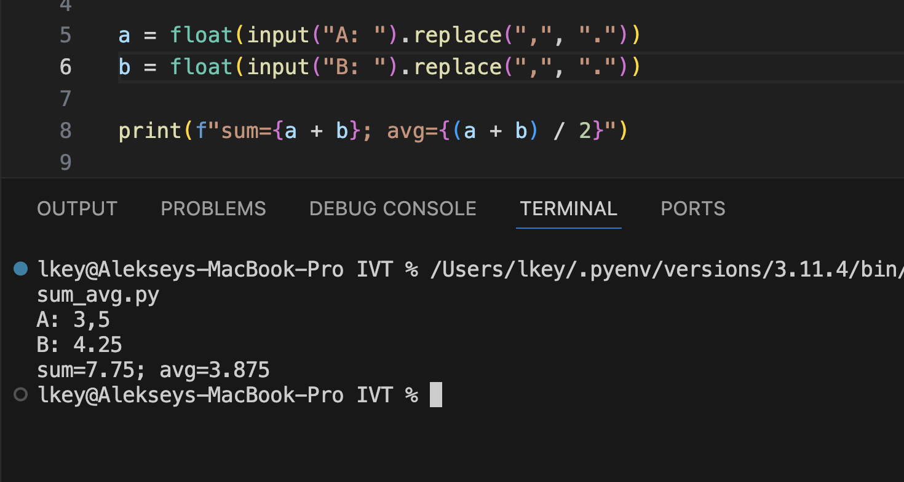

### Задание 3
```python
price = float(input("Цена: "))
discount = float(input("Скидка: "))
vat = float(input("НДС: "))

base = price * (1 - discount / 100)
vat_amount = base * (vat / 100)
total = base + vat_amount

print(f"База после скидки: {base:.2f} ₽")
print(f"НДС:               {vat_amount:.2f} ₽")
print(f"Итого к оплате:    {total:.2f} ₽")
```


### Задание 4
```python
m = int(input("Минуты: "))
print(f"{m // 60:02d}:{m % 60:02d}")
```


### Задание 5
```python
fio = input("ФИО: ")
print(f"Инициалы: {''.join([i[0].upper() for i in fio.split()])}.")
print(f"Длина: {len(fio.strip())}")
```
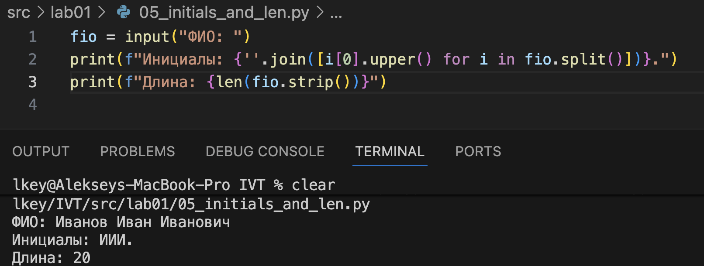

### Задание 6
```python
n = int(input("Пришло людей: "))
ochno = zaochno = 0
for i in range(n):
    info = input().split()
    if info[3] == "True":
        ochno += 1
    else:
        zaochno += 1

print(f"Очно: {ochno}; Заочно: {zaochno}")
```


### Задание 7
```python
hashed_str = input("Зашифрованная строка: ")
correct_letter = [""]
first_index = -1

for i in range(len(hashed_str)):
    if hashed_str[i] in "ABCDEFGHIJKLMNOPQRSTUVWXYZ" and len(correct_letter[0]) == 0:
        correct_letter[0] = hashed_str[i]
        first_index = i
    elif (
        hashed_str[i] in "0123456789" and len(correct_letter) == 1 and first_index != -1
    ):
        step = i + 1 - first_index
        for j in range(i + 1, len(hashed_str), step):
            correct_letter.append(hashed_str[j])
        break
print("".join(correct_letter) + ".")
```
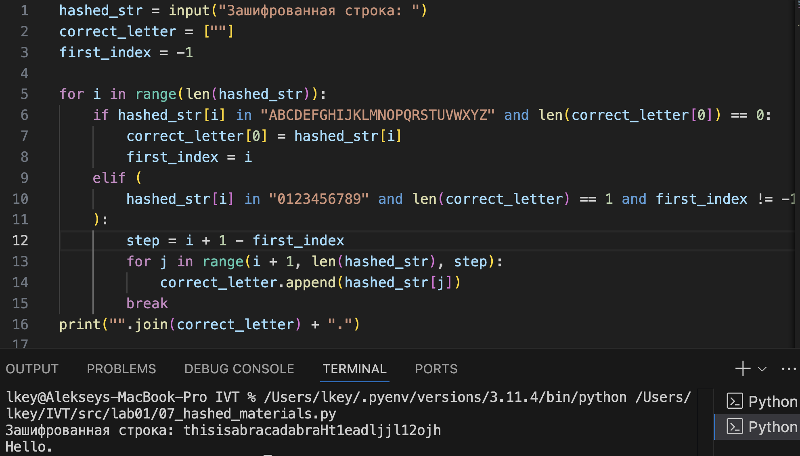


## Лабораторная работа 2

### Задание 1.1
```python
def min_max(nums: list[float | int]) -> tuple[float | int, float | int]:
    if len(nums) == 0:
        return ValueError

    mi = 9e6
    ma = -9e6

    for i in range(len(nums)):
        if nums[i] < mi:
            mi = nums[i]
        if nums[i] > ma:
            ma = nums[i]

    return tuple([mi, ma])
```
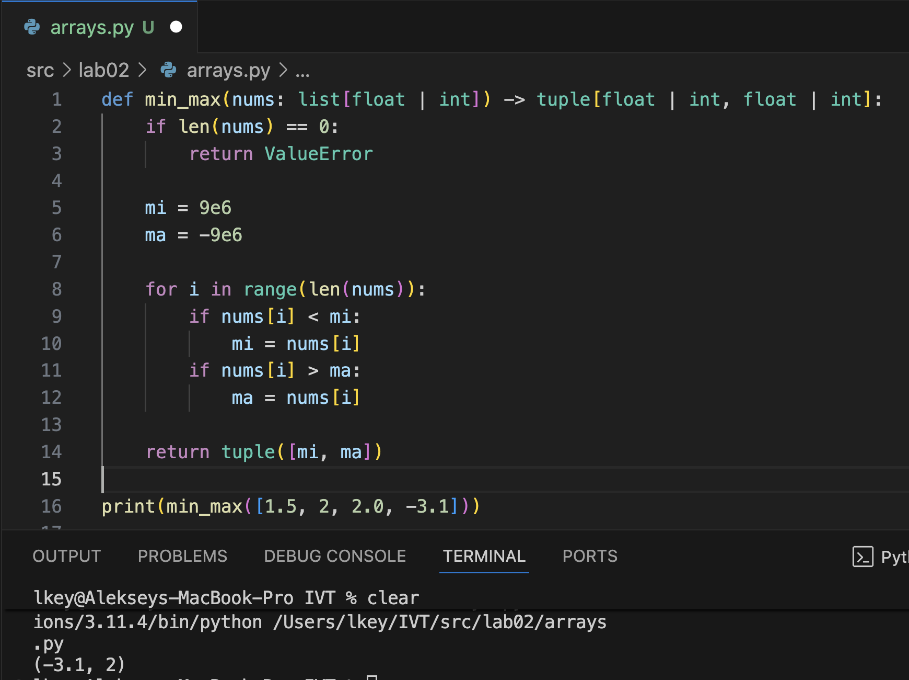

### Задание 1.2
```python
def unique_sorted(nums: list[float | int]) -> list[float | int]:
    return sorted(set(nums))
```
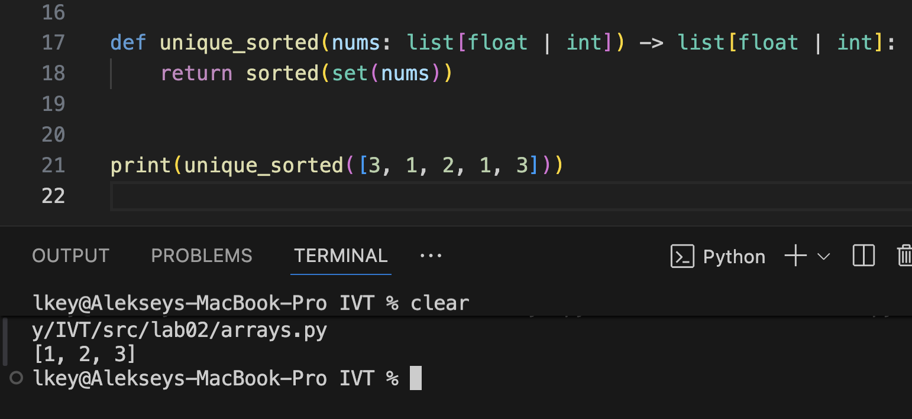

### Задание 1.3
```python
def flatten(mat: list[list | tuple]) -> list:
    array = list()
    for arr in mat:
        if not (isinstance(arr, tuple) or isinstance(arr, list)):
            return TypeError
        for member in arr:
            array.append(member)
    return array
```
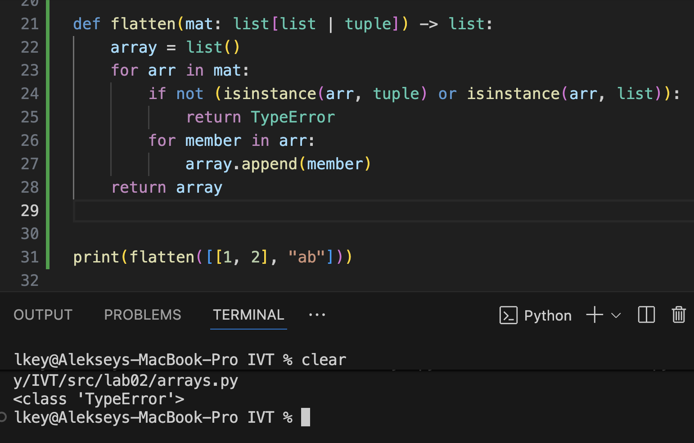

### Задание B.1
```python
def check_is_valid(mat: list[list[float | int]]) -> bool:
    if any(len(mat[0]) != len(mat[i]) for i in range(len(mat))):
        return False
    return True


def transpose(mat: list[list[float | int]]) -> list[list]:
    if len(mat) == 0:
        return []

    if not check_is_valid(mat=mat):
        return ValueError

    new_matrix = [[0 for j in range(len(mat))] for i in range(len(mat[0]))]

    for i in range(len(mat)):
        for j in range(len(mat[i])):
            new_matrix[j][i] = mat[i][j]

    return new_matrix
```
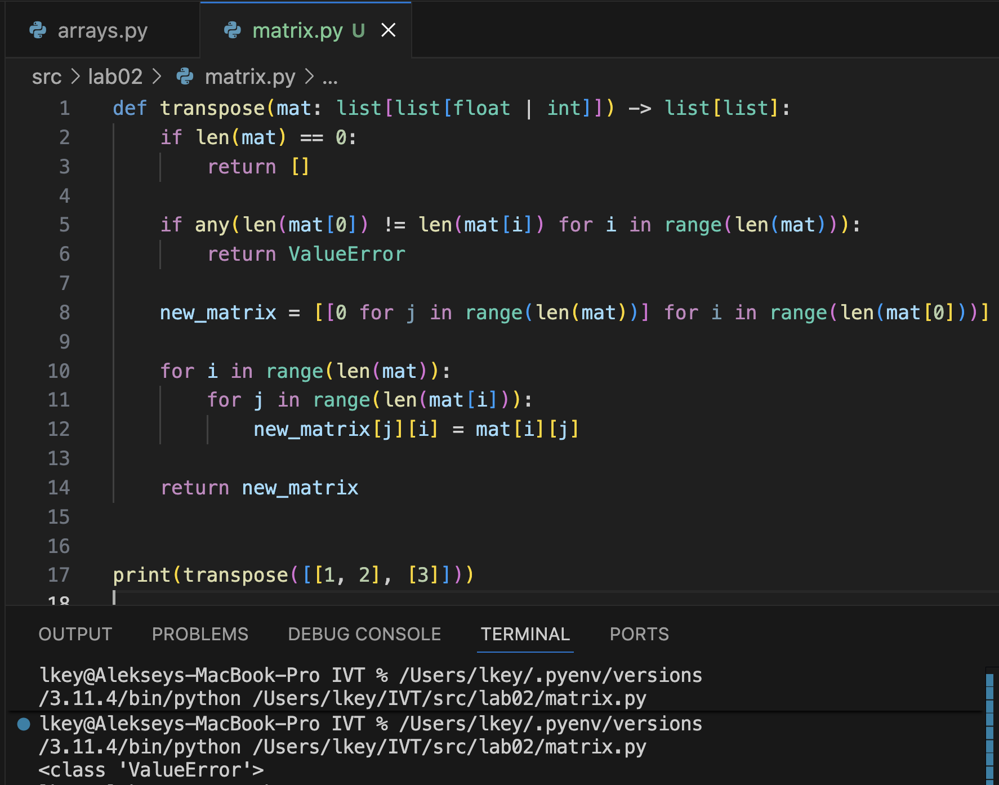

### Задание B.2
```python
def check_is_valid(mat: list[list[float | int]]) -> bool:
    if any(len(mat[0]) != len(mat[i]) for i in range(len(mat))):
        return False
    return True

def row_sums(mat: list[list[float | int]]) -> list[float]:
    if not check_is_valid(mat=mat):
        return ValueError

    array = list()
    for arr in mat:
        array.append(sum(arr))
    return array
```
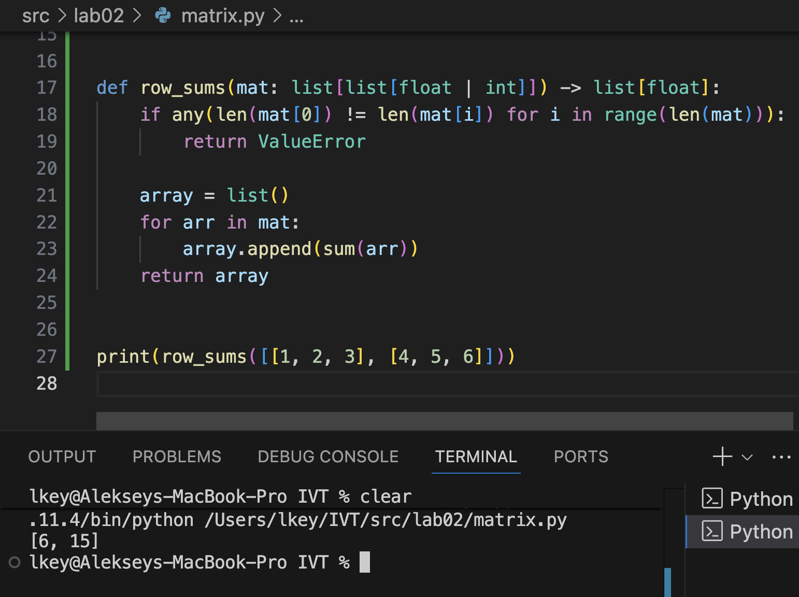

### Задание B.3
```python
def check_is_valid(mat: list[list[float | int]]) -> bool:
    if any(len(mat[0]) != len(mat[i]) for i in range(len(mat))):
        return False
    return True
    
def col_sums(mat: list[list[float | int]]) -> list[float]:
    if not check_is_valid(mat=mat):
        return ValueError

    array = list(0 for i in range(len(mat[0])))
    for i in range(len(mat)):
        for j in range(len(mat[i])):
            array[j] += mat[i][j]
    return array
```
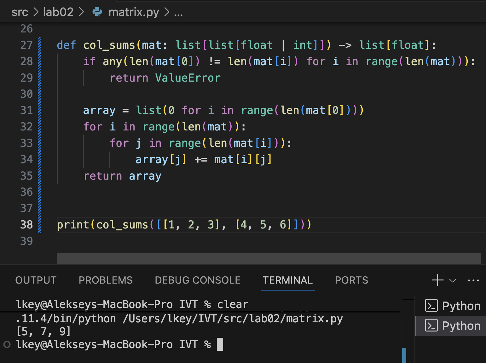

### Задание C
```python
def format_record(rec: tuple[str, str, float]) -> str:
    """
    Форматирует запись о студенте в удобочитаемую строку.

    Аргументы:
        rec (tuple[str, str, float]): Кортеж из трёх элементов:
            - rec[0]: ФИО (фамилия, имя и, при наличии, отчество) в виде строки,
                      допускается наличие лишних пробелов.
            - rec[1]: Обозначение группы (строка).
            - rec[2]: Средний балл (GPA) — число с плавающей точкой
                      или значение, приводимое к float.

    Возвращает:
        str: Отформатированную строку вида:
             "Фамилия И.О., гр. ГРУППА, GPA X.XX"

             Примеры:
             - ("иванов иван иванович", "ABB-01", 4.55)
               → "Иванов И.И., гр. ABB-01, GPA 4.55"
             - ("сидорова анна", "CS-22", 3.9)
               → "Сидорова A., гр. CS-22, GPA 3.90"

    Исключения:
        ValueError:
            Если некорректно указано ФИО или группа.

        TypeError:
            Если средний балл невозможно преобразовать в дробное число.

    Примечания:
        - Поддерживаются имена, состоящие из 1, 2 или 3 частей
          (фамилия; фамилия + имя; фамилия + имя + отчество).
        - Лишние пробелы в строках ФИО и группы игнорируются.
    """

    name_data = rec[0].strip().split()

    if len(name_data) > 2:
        surname, name, patronymic = rec[0].strip().split()
        name_string_data = f"{surname[0].upper()}{surname[1:]} {name[0].upper()}.{patronymic[0].upper()}."
    elif len(name_data) == 2:
        surname, name = rec[0].strip().split()
        name_string_data = f"{surname[0].upper()}{surname[1:]} {name[0].upper()}."
    elif len(name_data) == 1:
        surname = rec[0].strip().split()
        name_string_data = f"{surname[0].upper()}{surname[1:]}"
    else:
        return ValueError

    group = rec[1].strip()
    if group == "":
        return ValueError

    try:
        gpa = float(rec[2])
    except Exception as _:
        return TypeError

    return f"{name_string_data}, гр. {group}, GPA {gpa:.2f}"
```
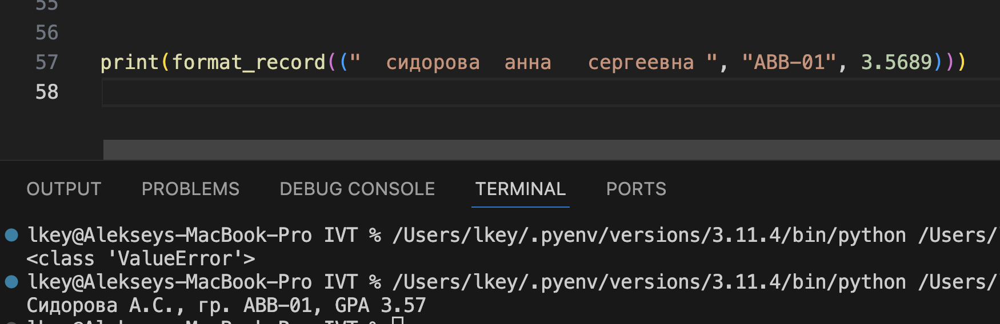
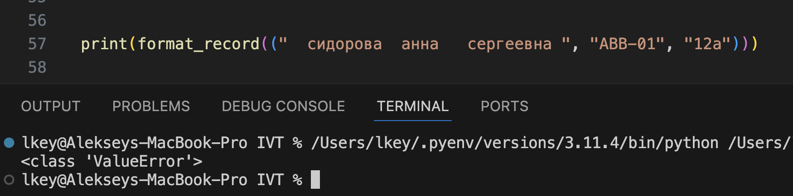


## Лабораторная работа 3

### Задание A
```python
def normalize(text: str, *, casefold: bool = True, yo2e: bool = True) -> str:
    """
    Нормализация текста:
        - приводит к нижнему регистру (если casefold=True)
        - заменяет 'ё' → 'е' и 'Ё' → 'Е' (если yo2e=True)
        - заменяет символы табуляции, перевода строки и возврата каретки на пробел
        - сжимает последовательности пробелов до одного
        - удаляет пробелы в начале и конце строки

    Примеры:
        - "ПрИвЕт\nМИр\t" → "привет мир" (casefold + схлопнуть пробелы)
        - "ёжик, Ёлка" (yo2e=True) → "ежик, елка"
        - "Hello\r\nWorld" → "hello world"
        - "  двойные   пробелы  " → "двойные пробелы"
    """

    if casefold:
        text = text.casefold()
    if yo2e:
        text = text.replace("ё", "е").replace("Ё", "Е")

    text = text.replace("\t", " ").replace("\r", " ").replace("\n", " ")

    while "  " in text:
        text = text.replace(" " * 2, " ")

    return text.strip()
```


```python
def tokenize(text: str) -> list[str]:
    """
    Разбиение текста на токены (слова):
    - словом считается последовательность символов \w (буквы, цифры, подчёркивание)
    - допускается наличие дефиса внутри слова (например, 'по-настоящему')
    - числа также считаются словами
    - разделителями считаются все небуквенно-цифровые символы (пробелы, пунктуация, эмодзи и т.п.)

    Примечание:
        \w = [A-Za-zА-Яа-я0-9_]
        (?:-\w+)* - означает «ноль или больше фрагментов
        вида - + слово» (hello-world-2025)

    Примеры:
        "привет мир" → ["привет", "мир"]
        "hello,world!!!" → ["hello", "world"]
        "по-настоящему круто" → ["по-настоящему", "круто"]
        "2025 год" → ["2025", "год"]
        "emoji 😀 не слово" → ["emoji", "не", "слово"]
    """

    tokens = finditer(pattern=r"\w+(-\w+)*", string=text)

    return [i.group() for i in tokens]
```
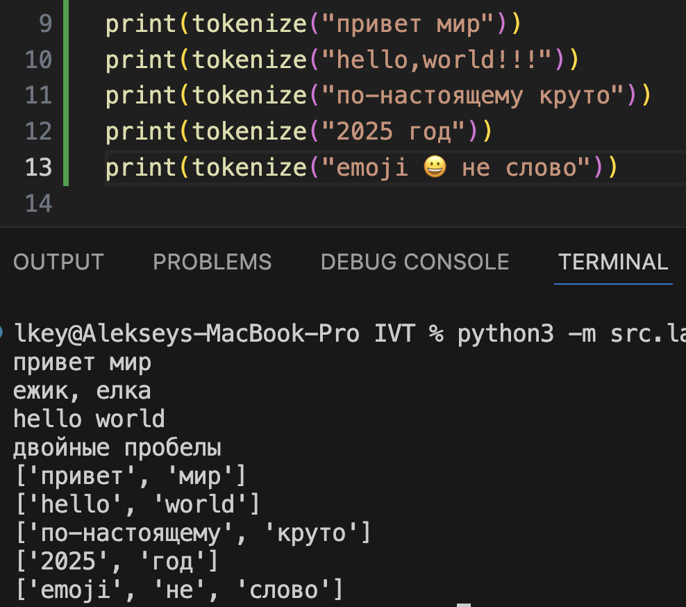

```python
def count_freq(tokens: list[str]) -> dict[str, int]:
    """
    Подсчёт частоты встречаемости токенов.
    На вход подаётся список токенов (строк).
    На выходе возвращается словарь {токен: количество}.

    Примеры:
        - ["a","b","a","c","b","a"] → частоты {"a":3,"b":2,"c":1};
        - При равенстве частот: токены ["bb","aa","bb","aa","cc"] →
        частоты {"aa":2,"bb":2,"cc":1};

    """

    counts = {}

    for i in tokens:
        if i in counts:
            counts[i] += 1
        else:
            counts[i] = 1

    return counts

def top_n(freq: dict[str, int], n: int = 5) -> list[tuple[str, int]]:
    """
    Выборка топ-N наиболее частых токенов.
    - сортировка по убыванию частоты
    - при равной частоте сортировка лексикографическая (по алфавиту)
    - возвращает список кортежей (токен, частота)

    Примеры:
        - top_n(..., n=2) → [("a",3), ("b",2)]
        - top_n(..., n=2) → [("aa",2), ("bb",2)]
        (алфавитная сортировка при равенстве).
    """

    freq = sorted(freq.items(), key=lambda item: [-item[1], item[0]])
    top_n = []

    for i in range(min(n, len(freq))):
        top_n.append((freq[i][0], freq[i][1]))

    return top_n
```
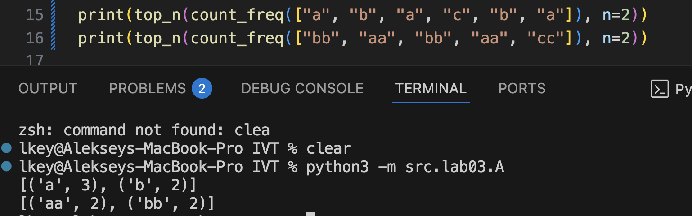

### Задание B
```python

def table(title: str, description: str, top: list[tuple[str, int]]) -> None:
    max_word_length = max([len(i[0]) for i in top]) + 1

    print(f"{title}{(max_word_length - 5) * ' '}| {description}")
    print("-" * (max_word_length + 2 + max_word_length))
    for i in top:
        word, count = i
        print(f"{word}{(max_word_length - len(word)) * ' '}| {count}")

"""
Функции:
    - Считает общее количество слов
    - Считает количество уникальных слов
    - Находит топ-5 наиболее частых слов

Токенизация и нормализация текста выполняются с помощью функций из src.lib.text:
    - normalize() — нормализует текст (нижний регистр, убирает лишние пробелы и заменяет 'ё' на 'е')
    - tokenize() — разбивает текст на слова/числа
    - count_freq() — считает частоты слов
    - top_n() — возвращает топ-N наиболее частых слов

Запуск:
    Из корня проекта:
        python3 -m src.lab03.text_stats < src/lab03/input.txt

Переменные:
    IS_TABLE — если True, выводится красивая таблица; иначе простая печать токен:частота
"""

IS_TABLE = True

text = sys.stdin.read()

text = normalize(text=text)

tokens = tokenize(text=text)

top = top_n(count_freq(tokens=tokens), n=5)

print(f"Всего слов: {len(tokens)}")
print(f"Уникальных слов: {len(set(tokens))}")
print("Топ-5:")

if IS_TABLE:
    table(title="cлово", description="частота", top=top)
else:
    for i in top:
        print(f"{i[0]}:{i[1]}")
```
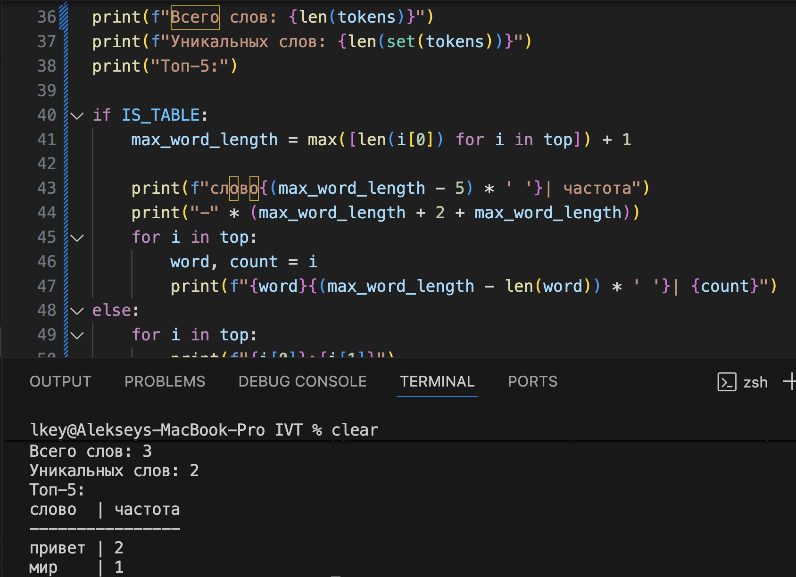


## Лабораторная работа 4

### Задание A
```python
from pathlib import Path
import csv
from typing import Iterable, Sequence
from collections import Counter
from src.lib.text import normalize, tokenize

"""
Функции:
    - read_text: чтение текстового файла целиком
    - write_csv: запись строк в CSV-файл
    - ensure_parent_dir: создание родительских директорий (опционально)
    - frequencies_from_text: частоты слов (использует normalize/tokenize из ЛР3)
    - sorted_word_counts: сортировка слов по убыванию частоты и алфавиту

Пример использования:
    from src.lab04.io_txt_csv import read_text, write_csv

    txt = read_text("data/input.txt")   # возвращает содержимое файла как строку
    write_csv([("word", "count"), ("test", 3)], "data/check.csv")  # создаст CSV

Краевые случаи:
    - Пустой файл -> возвращается пустая строка.
    - Очень большой файл -> читается целиком (по нашему ТЗ).
      В README рекомендуется построчное чтение для реальных больших данных.
    - write_csv([], "file.csv", header=None) -> создаётся пустой файл (0 строк).
    - write_csv([], "file.csv", header=("a","b")) -> файл содержит только заголовок.
"""


def read_text(path: str | Path, encoding: str = "utf-8") -> str:
    """
    Открыть текстовый файл и вернуть его содержимое как одну строку.

    Аргументы:
        path: путь к файлу (строка или pathlib.Path).
        encoding: кодировка файла (по умолчанию "utf-8").
                  Если нужна другая, можно указать, например: encoding="cp1251".

    Возвращает:
        str: содержимое файла.

    Падает с ошибками:
        FileNotFoundError: если файл не найден.
        UnicodeDecodeError: если содержимое не подходит под выбранную кодировку.
    """

    p = Path(path)
    return p.read_text(encoding=encoding)


def ensure_parent_dir(path: str | Path) -> None:
    """
    Создать родительские директории для указанного пути, если их ещё нет.

    Args:
        path: путь к файлу (строка или pathlib.Path).
    """
    p = Path(path)
    if p.parent and not p.parent.exists():
        p.parent.mkdir(parents=True, exist_ok=True)


def write_csv(
    rows: Iterable[Sequence], path: str | Path, header: tuple[str, ...] | None = None
) -> None:
    """
    Создать или перезаписать CSV-файл с разделителем ','.

    Аргументы:
        rows: последовательность строк (каждая строка — tuple или list).
        path: путь к CSV-файлу (строка или pathlib.Path).
        header: необязательный заголовок (tuple[str,...]), будет записан первой строкой.

    Падает с ошибкой:
        ValueError: если строки имеют разную длину.
    """

    p = Path(path)
    ensure_parent_dir(p)

    rows = list(rows)
    with p.open("w", newline="", encoding="utf-8") as f:
        w = csv.writer(f)
        if header is not None:
            w.writerow(header)
        for r in rows:
            w.writerow(r)


def frequencies_from_text(text: str) -> dict[str, int]:
    """
    Подсчитать частоты слов в тексте, используя normalize/tokenize из ЛР3.

    Аргументы:
        text: исходный текст.

    Возвращает:
        dict[str, int]: словарь слово -> частота.
    """

    tokens = tokenize(normalize(text))
    return Counter(tokens)  # dict-like


def sorted_word_counts(freq: dict[str, int]) -> list[tuple[str, int]]:
    """
    Отсортировать пары (слово, частота):
      - сначала по убыванию частоты,
      - затем по алфавиту.

    Аргументы:
        freq: словарь слово -> частота.

    Возвращает:
        list[tuple[str, int]]: отсортированный список.
    """

    return sorted(freq.items(), key=lambda kv: (-kv[1], kv[0]))
```
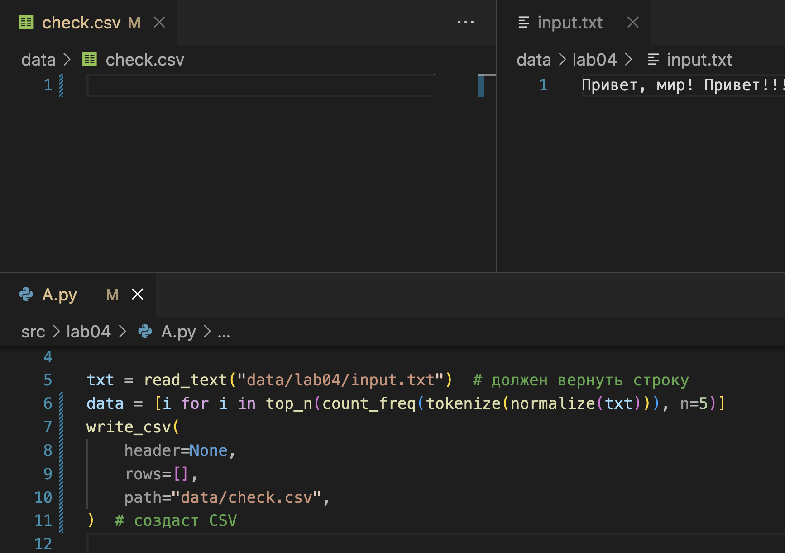

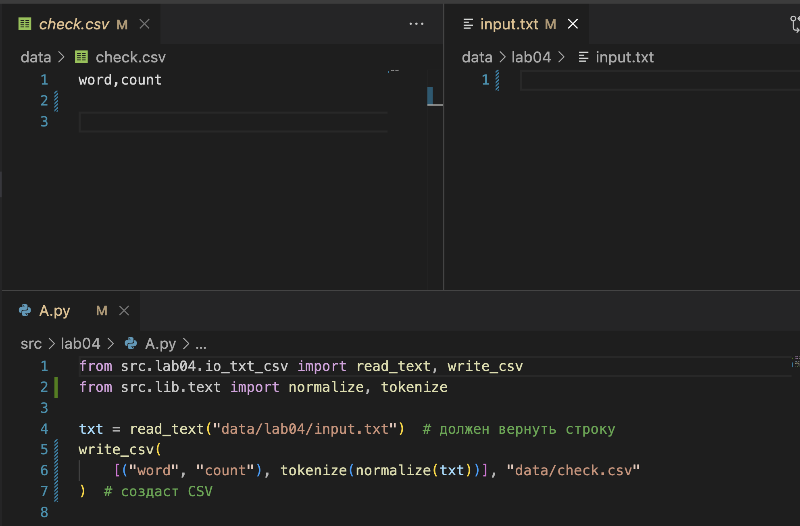

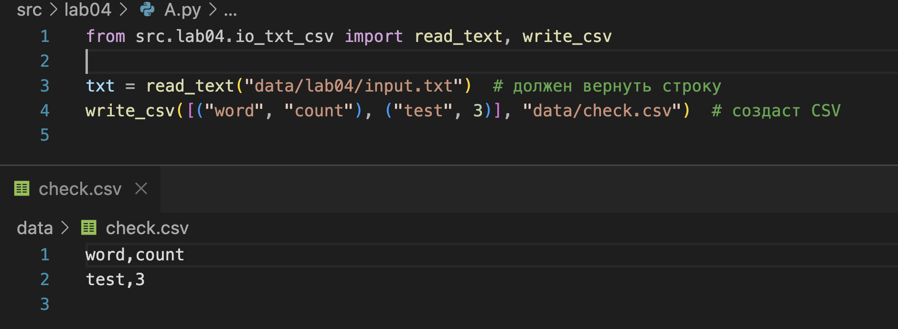

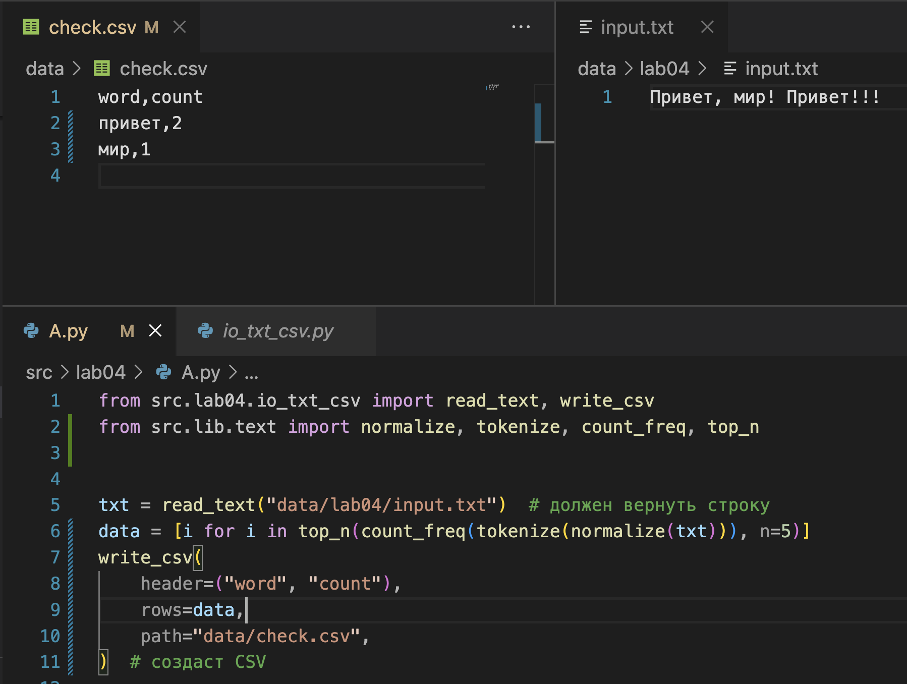

### Задание B

```python
from src.lab04.io_txt_csv import (
    read_text,
    write_csv,
    frequencies_from_text,
    sorted_word_counts,
)
import argparse
from src.lib.table import print_summary


def main():
    """
    Анализ текста и сохранение отчёта в CSV.

    Скрипт выполняет:
        1. Читает входной текстовый файл (--in, по умолчанию data/input.txt).
        2. Нормализует и токенизирует текст (функции из src/lib/text.py).
        3. Считает частоты слов.
        4. Сохраняет результат в CSV (--out, по умолчанию data/report.csv)
           с колонками: word,count (отсортировано по убыванию частоты, затем по слову).
        5. Печатает резюме в консоль:
            - количество всех слов
            - количество уникальных слов
            - топ-5 слов (в табличной форме или в виде списка).

    Аргументы командной строки:
        --in <путь>       путь к входному текстовому файлу (по умолчанию data/input.txt)
        --out <путь>      путь к выходному CSV (по умолчанию data/report.csv)
        --encoding <код>  кодировка входного файла (по умолчанию utf-8).
                          Например: --encoding cp1251

    Примеры запуска:
        python3 -m src.lab04.text_report
        python3 -m src.lab04.text_report --in data/lab04/b.txt --out data/report.csv
        python3 -m src.lab04.text_report --in data/lab04/a.txt --encoding cp1251u

    Падает с ошибками:
        - Если входной файл не найден → FileNotFoundError.
        - Если кодировка не подходит → UnicodeDecodeError.
        - Пустой файл → report.csv будет содержать только заголовок.
    """

    parser = argparse.ArgumentParser(description="Анализ текста и отчёт в CSV")
    parser.add_argument("--in", dest="input", default="data/lab04/input.txt")
    parser.add_argument("--out", dest="output", default="data/report.csv")
    parser.add_argument("--encoding", dest="encoding", default="utf-8")
    args = parser.parse_args()

    text = read_text(
        path=args.input,
        encoding=args.encoding,
    )
    freq = frequencies_from_text(text)
    data = sorted_word_counts(freq)

    write_csv(
        header=("word", "count"),
        rows=data,
        path=args.output,
    )

    print_summary(text=text, is_table=True)


main()
```
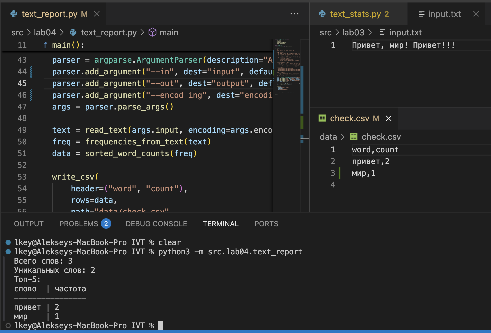

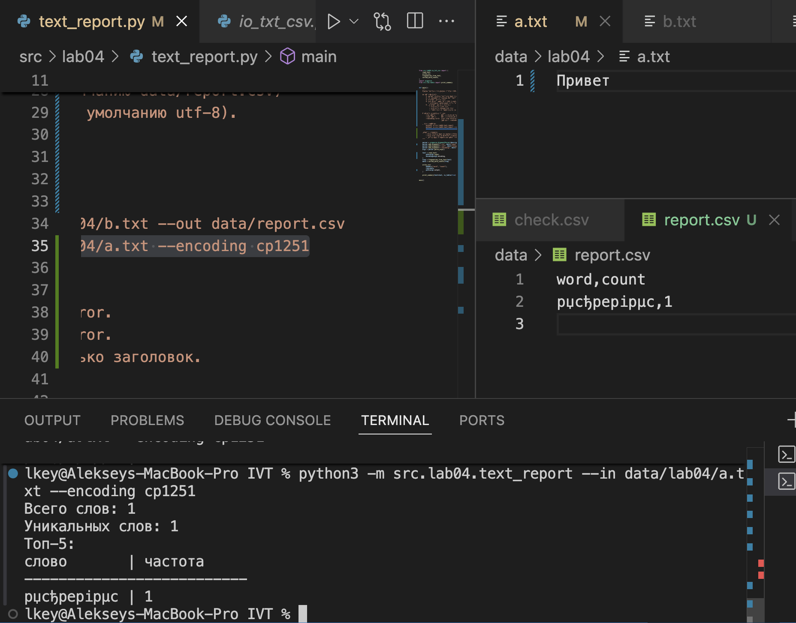

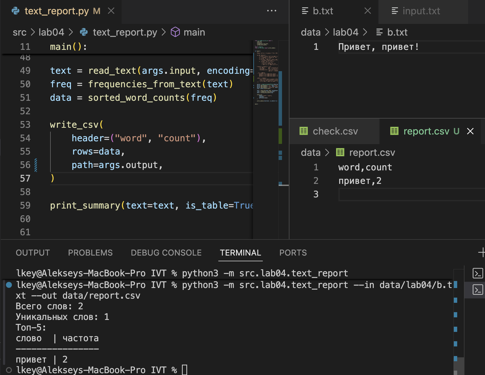
