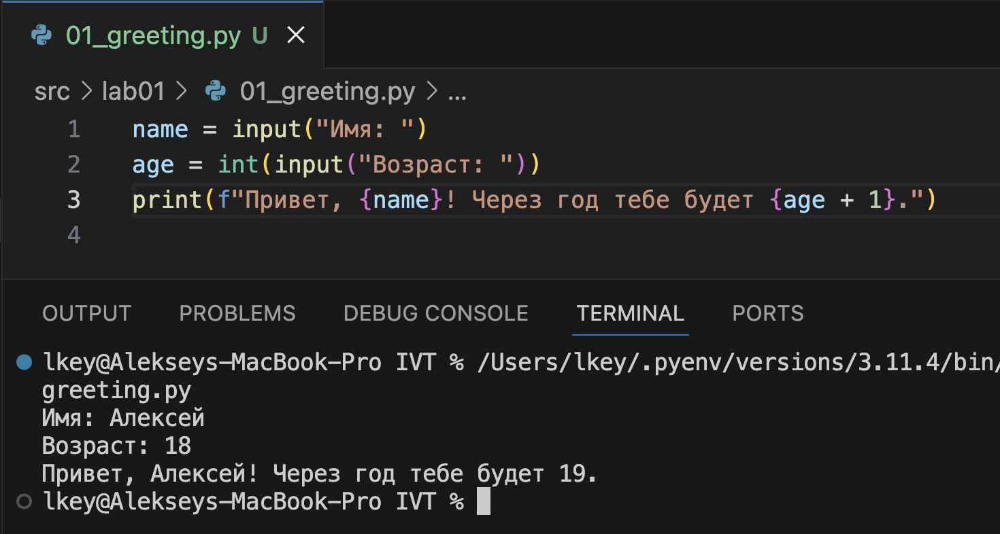
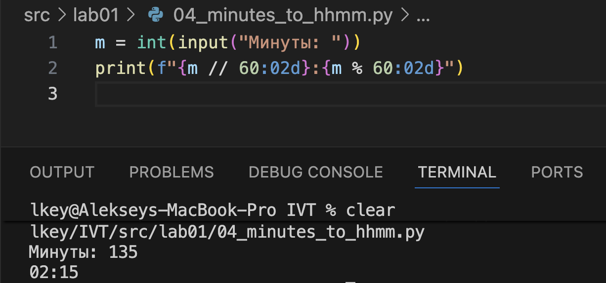
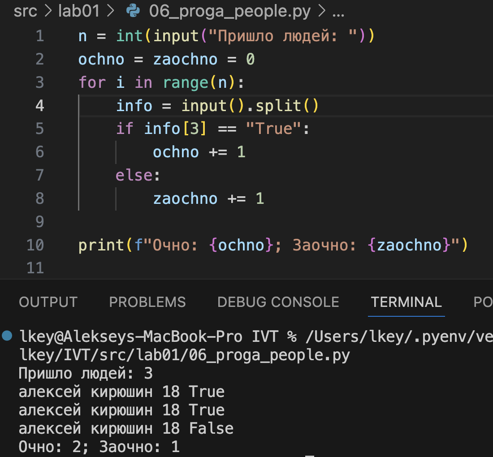

## Лабораторная работа 1

### Задание 1
```python
name = input("Имя: ")
age = int(input("Возраст: "))
print(f"Привет, {name}! Через год тебе будет {age + 1}.")
```


### Задание 2
```python
a = float(input("A: ").replace(",", "."))
b = float(input("B: ").replace(",", "."))

print(f"sum={a + b}; avg={(a + b) / 2:.2f}")
```


### Задание 3
```python
price = float(input("Цена: "))
discount = float(input("Скидка: "))
vat = float(input("НДС: "))

base = price * (1 - discount / 100)
vat_amount = base * (vat / 100)
total = base + vat_amount

print(f"База после скидки: {base:.2f} ₽")
print(f"НДС:               {vat_amount:.2f} ₽")
print(f"Итого к оплате:    {total:.2f} ₽")
```


### Задание 4
```python
m = int(input("Минуты: "))
print(f"{m // 60:02d}:{m % 60:02d}")
```


### Задание 5
```python
fio = input("ФИО: ")
print(f"Инициалы: {''.join([i[0].upper() for i in fio.split()])}.")
print(f"Длина: {len(fio.strip())}")
```


### Задание 6
```python
n = int(input("Пришло людей: "))
ochno = zaochno = 0
for i in range(n):
    info = input().split()
    if info[3] == "True":
        ochno += 1
    else:
        zaochno += 1

print(f"Очно: {ochno}; Заочно: {zaochno}")
```


### Задание 7
```python
hashed_str = input("Зашифрованная строка: ")
correct_letter = [""]
first_index = -1

for i in range(len(hashed_str)):
    if hashed_str[i] in "ABCDEFGHIJKLMNOPQRSTUVWXYZ" and len(correct_letter[0]) == 0:
        correct_letter[0] = hashed_str[i]
        first_index = i
    elif (
        hashed_str[i] in "0123456789" and len(correct_letter) == 1 and first_index != -1
    ):
        step = i + 1 - first_index
        for j in range(i + 1, len(hashed_str), step):
            correct_letter.append(hashed_str[j])
        break
print("".join(correct_letter) + ".")
```


## Лабораторная работа 2

### Задание 1
```python
def format_record(rec: tuple[str, str, float]) -> str:
    """
    Форматирует запись о студенте в удобочитаемую строку.

    Аргументы:
        rec (tuple[str, str, float]): Кортеж из трёх элементов:
            - rec[0]: ФИО (фамилия, имя и, при наличии, отчество) в виде строки,
                      допускается наличие лишних пробелов.
            - rec[1]: Обозначение группы (строка).
            - rec[2]: Средний балл (GPA) — число с плавающей точкой
                      или значение, приводимое к float.

    Возвращает:
        str: Отформатированную строку вида:
             "Фамилия И.О., гр. ГРУППА, GPA X.XX"

             Примеры:
             - ("иванов иван иванович", "ABB-01", 4.55)
               → "Иванов И.И., гр. ABB-01, GPA 4.55"
             - ("сидорова анна", "CS-22", 3.9)
               → "Сидорова A., гр. CS-22, GPA 3.90"

    Исключения:
        ValueError:
            Если некорректно указано ФИО или группа.

        TypeError:
            Если средний балл невозможно преобразовать в дробное число.

    Примечания:
        - Поддерживаются имена, состоящие из 1, 2 или 3 частей
          (фамилия; фамилия + имя; фамилия + имя + отчество).
        - Лишние пробелы в строках ФИО и группы игнорируются.
    """

    name_data = rec[0].strip().split()

    if len(name_data) > 2:
        surname, name, patronymic = rec[0].strip().split()
        name_string_data = f"{surname[0].upper()}{surname[1:]} {name[0].upper()}.{patronymic[0].upper()}."
    elif len(name_data) == 2:
        surname, name = rec[0].strip().split()
        name_string_data = f"{surname[0].upper()}{surname[1:]} {name[0].upper()}."
    elif len(name_data) == 1:
        surname = rec[0].strip().split()
        name_string_data = f"{surname[0].upper()}{surname[1:]}"
    else:
        return ValueError

    group = rec[1].strip()
    if group == "":
        return ValueError

    try:
        gpa = float(rec[2])
    except Exception as _:
        return TypeError

    return f"{name_string_data}, гр. {group}, GPA {gpa:.2f}"
```


### Задание 2
```python
def min_max(nums: list[float | int]) -> tuple[float | int, float | int]:
    if len(nums) == 0:
        return ValueError

    mi = 9e6
    ma = -9e6

    for i in range(len(nums)):
        if nums[i] < mi:
            mi = nums[i]
        if nums[i] > ma:
            ma = nums[i]

    return tuple([mi, ma])
```


### Задание 3
```python
def unique_sorted(nums: list[float | int]) -> list[float | int]:
    return sorted(set(nums))
```


### Задание 4
```python
def flatten(mat: list[list | tuple]) -> list:
    array = list()
    for arr in mat:
        if not (isinstance(arr, tuple) or isinstance(arr, list)):
            return TypeError
        for member in arr:
            array.append(member)
    return array
```


### Задание 5
```python
def check_is_valid(mat: list[list[float | int]]) -> bool:
    if any(len(mat[0]) != len(mat[i]) for i in range(len(mat))):
        return False
    return True


def transpose(mat: list[list[float | int]]) -> list[list]:
    if len(mat) == 0:
        return []

    if not check_is_valid(mat=mat):
        return ValueError

    new_matrix = [[0 for j in range(len(mat))] for i in range(len(mat[0]))]

    for i in range(len(mat)):
        for j in range(len(mat[i])):
            new_matrix[j][i] = mat[i][j]

    return new_matrix
```


### Задание 6
```python
def row_sums(mat: list[list[float | int]]) -> list[float]:
    if not check_is_valid(mat=mat):
        return ValueError

    array = list()
    for arr in mat:
        array.append(sum(arr))
    return array
```


### Задание 7
```python
def col_sums(mat: list[list[float | int]]) -> list[float]:
    if not check_is_valid(mat=mat):
        return ValueError

    array = list(0 for i in range(len(mat[0])))
    for i in range(len(mat)):
        for j in range(len(mat[i])):
            array[j] += mat[i][j]
    return array
```
