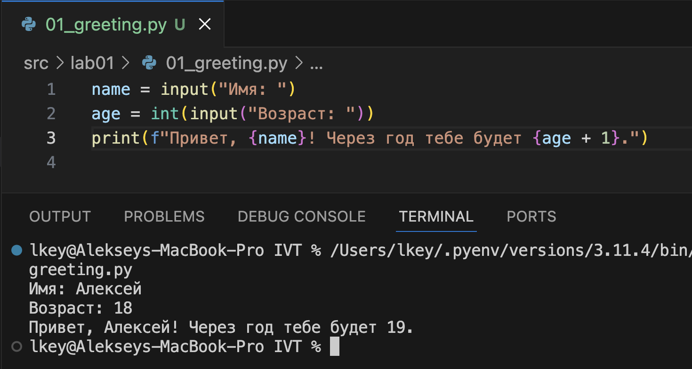
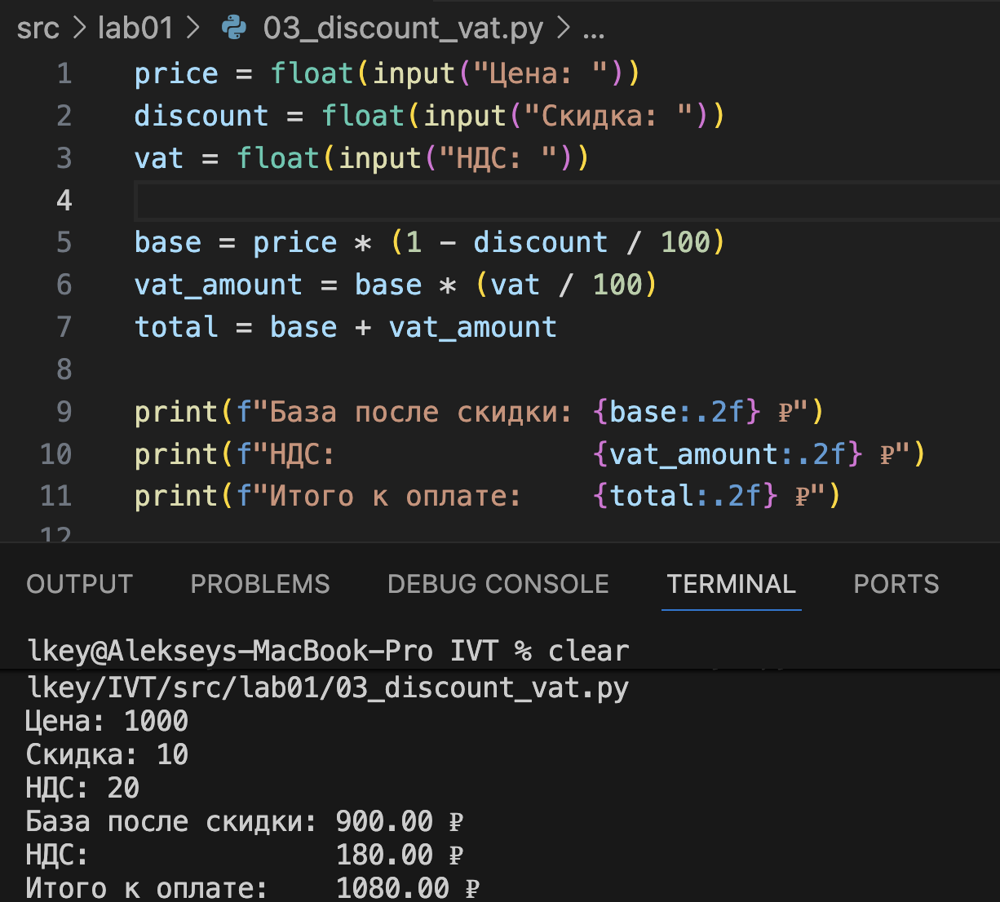
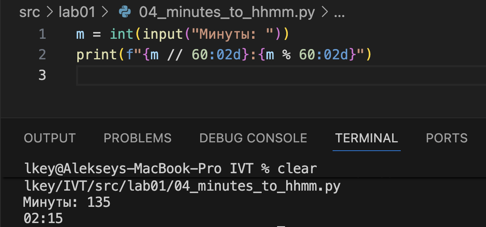
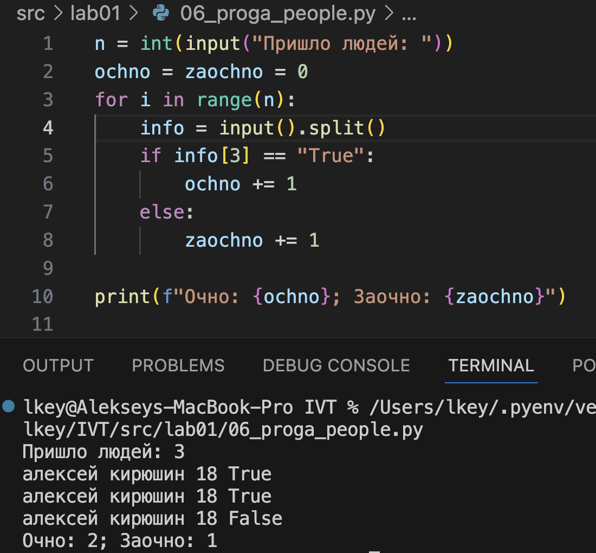

## Лабораторная работа 1

### Задание 1
```python
name = input("Имя: ")
age = int(input("Возраст: "))
print(f"Привет, {name}! Через год тебе будет {age + 1}.")
```


### Задание 2
```python
a = float(input("A: ").replace(",", "."))
b = float(input("B: ").replace(",", "."))

print(f"sum={a + b}; avg={(a + b) / 2:.2f}")
```


### Задание 3
```python
price = float(input("Цена: "))
discount = float(input("Скидка: "))
vat = float(input("НДС: "))

base = price * (1 - discount / 100)
vat_amount = base * (vat / 100)
total = base + vat_amount

print(f"База после скидки: {base:.2f} ₽")
print(f"НДС:               {vat_amount:.2f} ₽")
print(f"Итого к оплате:    {total:.2f} ₽")
```


### Задание 4
```python
m = int(input("Минуты: "))
print(f"{m // 60:02d}:{m % 60:02d}")
```


### Задание 5
```python
fio = input("ФИО: ")
print(f"Инициалы: {''.join([i[0].upper() for i in fio.split()])}.")
print(f"Длина: {len(fio.strip())}")
```


### Задание 6
```python
n = int(input("Пришло людей: "))
ochno = zaochno = 0
for i in range(n):
    info = input().split()
    if info[3] == "True":
        ochno += 1
    else:
        zaochno += 1

print(f"Очно: {ochno}; Заочно: {zaochno}")
```


### Задание 7
```python
hashed_str = input("Зашифрованная строка: ")
correct_letter = [""]
first_index = -1

for i in range(len(hashed_str)):
    if hashed_str[i] in "ABCDEFGHIJKLMNOPQRSTUVWXYZ" and len(correct_letter[0]) == 0:
        correct_letter[0] = hashed_str[i]
        first_index = i
    elif (
        hashed_str[i] in "0123456789" and len(correct_letter) == 1 and first_index != -1
    ):
        step = i + 1 - first_index
        for j in range(i + 1, len(hashed_str), step):
            correct_letter.append(hashed_str[j])
        break
print("".join(correct_letter) + ".")
```
