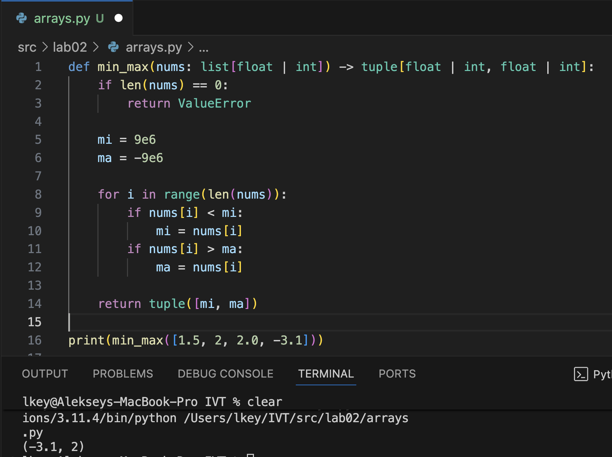
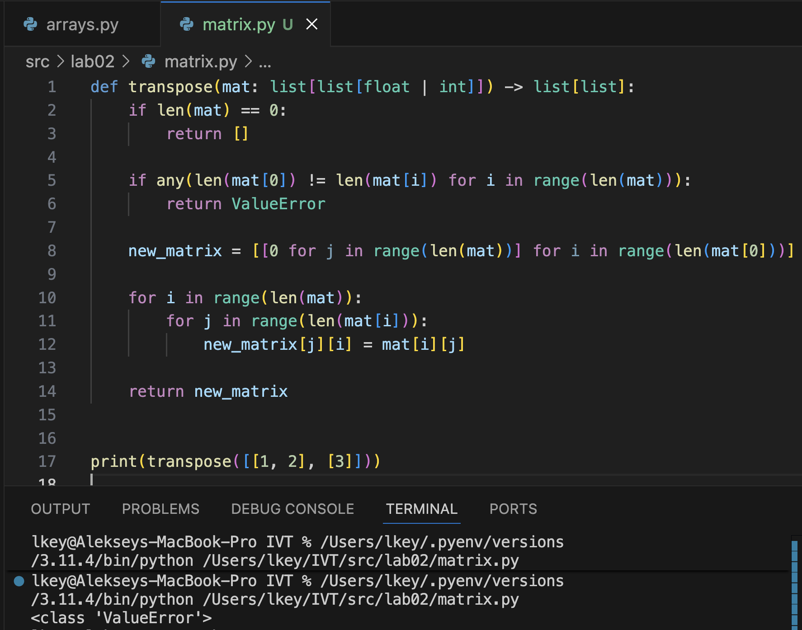
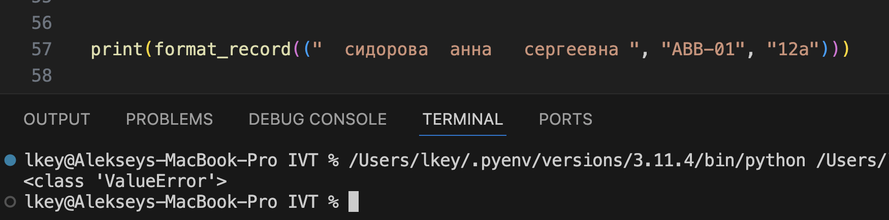

## Лабораторная работа 2

### Задание 1.1
```python
def min_max(nums: list[float | int]) -> tuple[float | int, float | int]:
    if len(nums) == 0:
        return ValueError

    mi = 9e6
    ma = -9e6

    for i in range(len(nums)):
        if nums[i] < mi:
            mi = nums[i]
        if nums[i] > ma:
            ma = nums[i]

    return tuple([mi, ma])
```


### Задание 1.2
```python
def unique_sorted(nums: list[float | int]) -> list[float | int]:
    return sorted(set(nums))
```


### Задание 1.3
```python
def flatten(mat: list[list | tuple]) -> list:
    array = list()
    for arr in mat:
        if not (isinstance(arr, tuple) or isinstance(arr, list)):
            return TypeError
        for member in arr:
            array.append(member)
    return array
```


### Задание B.1
```python
def check_is_valid(mat: list[list[float | int]]) -> bool:
    if any(len(mat[0]) != len(mat[i]) for i in range(len(mat))):
        return False
    return True


def transpose(mat: list[list[float | int]]) -> list[list]:
    if len(mat) == 0:
        return []

    if not check_is_valid(mat=mat):
        return ValueError

    new_matrix = [[0 for j in range(len(mat))] for i in range(len(mat[0]))]

    for i in range(len(mat)):
        for j in range(len(mat[i])):
            new_matrix[j][i] = mat[i][j]

    return new_matrix
```


### Задание B.2
```python
def check_is_valid(mat: list[list[float | int]]) -> bool:
    if any(len(mat[0]) != len(mat[i]) for i in range(len(mat))):
        return False
    return True

def row_sums(mat: list[list[float | int]]) -> list[float]:
    if not check_is_valid(mat=mat):
        return ValueError

    array = list()
    for arr in mat:
        array.append(sum(arr))
    return array
```


### Задание B.3
```python
def check_is_valid(mat: list[list[float | int]]) -> bool:
    if any(len(mat[0]) != len(mat[i]) for i in range(len(mat))):
        return False
    return True
    
def col_sums(mat: list[list[float | int]]) -> list[float]:
    if not check_is_valid(mat=mat):
        return ValueError

    array = list(0 for i in range(len(mat[0])))
    for i in range(len(mat)):
        for j in range(len(mat[i])):
            array[j] += mat[i][j]
    return array
```


### Задание C
```python
def format_record(rec: tuple[str, str, float]) -> str:
    """
    Форматирует запись о студенте в удобочитаемую строку.

    Аргументы:
        rec (tuple[str, str, float]): Кортеж из трёх элементов:
            - rec[0]: ФИО (фамилия, имя и, при наличии, отчество) в виде строки,
                      допускается наличие лишних пробелов.
            - rec[1]: Обозначение группы (строка).
            - rec[2]: Средний балл (GPA) — число с плавающей точкой
                      или значение, приводимое к float.

    Возвращает:
        str: Отформатированную строку вида:
             "Фамилия И.О., гр. ГРУППА, GPA X.XX"

             Примеры:
             - ("иванов иван иванович", "ABB-01", 4.55)
               → "Иванов И.И., гр. ABB-01, GPA 4.55"
             - ("сидорова анна", "CS-22", 3.9)
               → "Сидорова A., гр. CS-22, GPA 3.90"

    Исключения:
        ValueError:
            Если некорректно указано ФИО или группа.

        TypeError:
            Если средний балл невозможно преобразовать в дробное число.

    Примечания:
        - Поддерживаются имена, состоящие из 1, 2 или 3 частей
          (фамилия; фамилия + имя; фамилия + имя + отчество).
        - Лишние пробелы в строках ФИО и группы игнорируются.
    """

    name_data = rec[0].strip().split()

    if len(name_data) > 2:
        surname, name, patronymic = rec[0].strip().split()
        name_string_data = f"{surname[0].upper()}{surname[1:]} {name[0].upper()}.{patronymic[0].upper()}."
    elif len(name_data) == 2:
        surname, name = rec[0].strip().split()
        name_string_data = f"{surname[0].upper()}{surname[1:]} {name[0].upper()}."
    elif len(name_data) == 1:
        surname = rec[0].strip().split()
        name_string_data = f"{surname[0].upper()}{surname[1:]}"
    else:
        return ValueError

    group = rec[1].strip()
    if group == "":
        return ValueError

    try:
        gpa = float(rec[2])
    except Exception as _:
        return TypeError

    return f"{name_string_data}, гр. {group}, GPA {gpa:.2f}"
```

