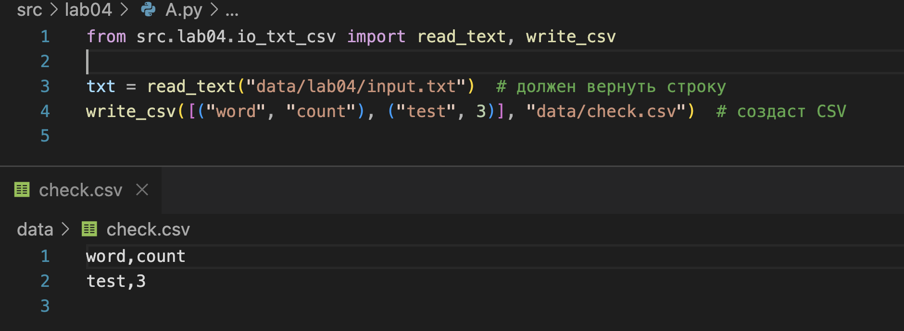
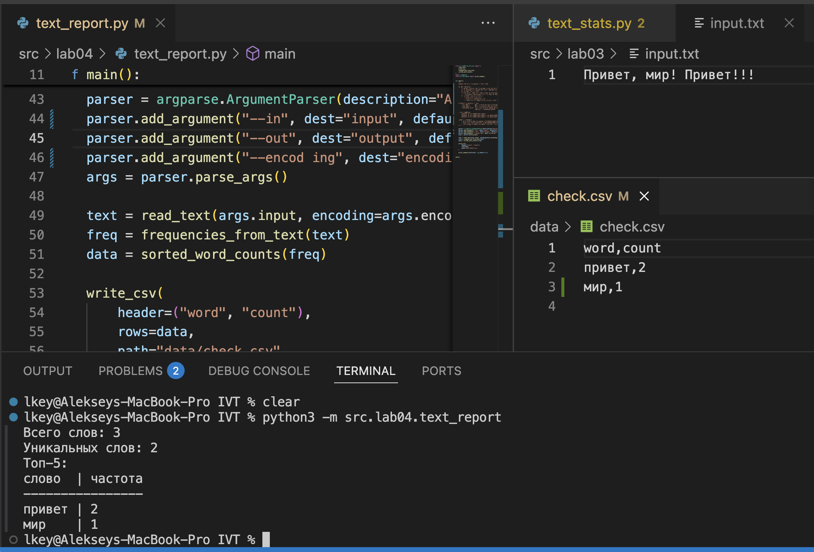
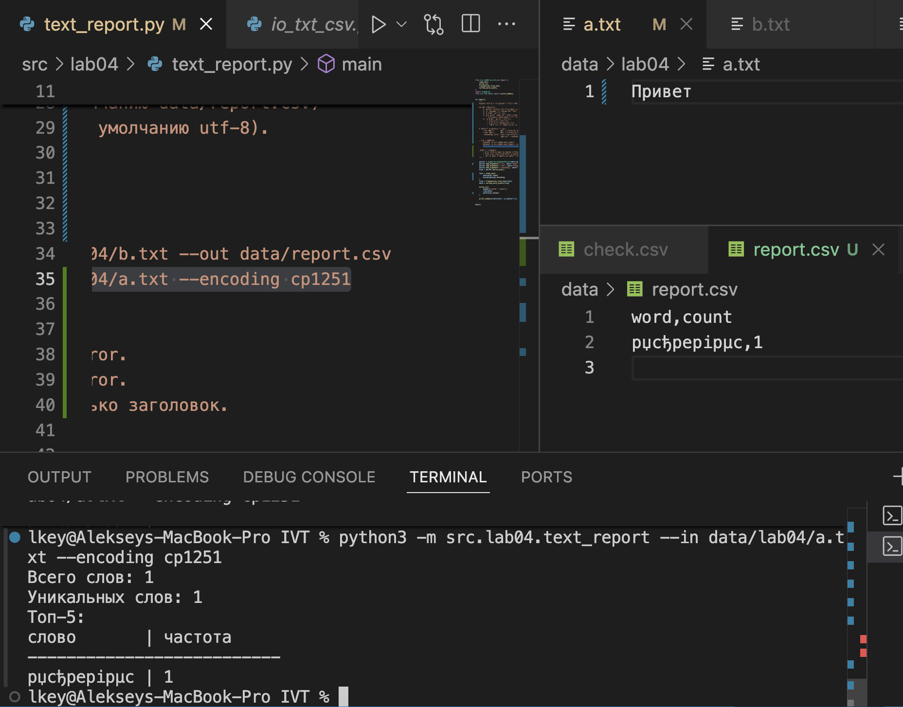
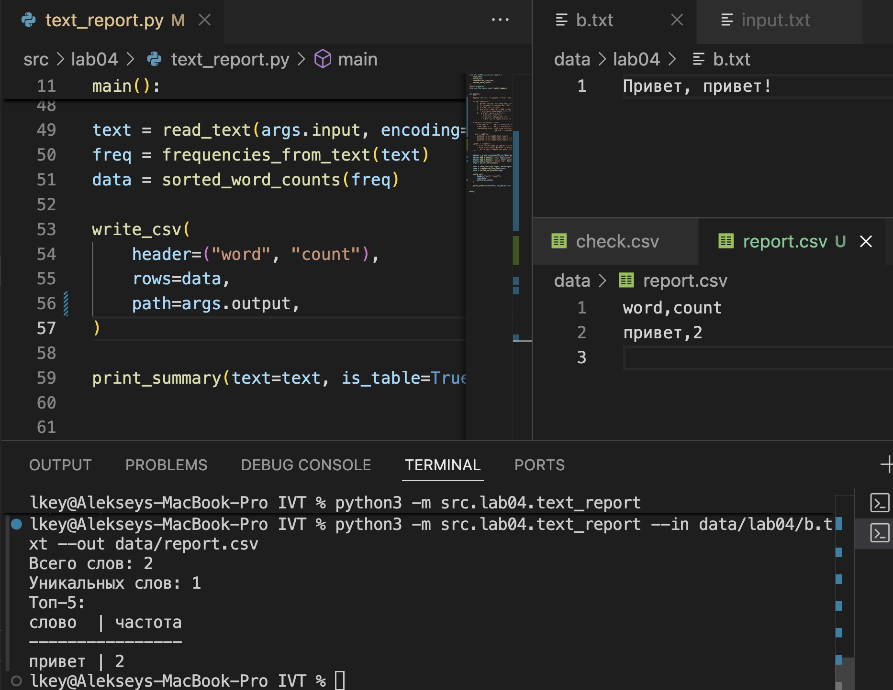

## Лабораторная работа 4

### Задание A
```python
from pathlib import Path
import csv
from typing import Iterable, Sequence
from collections import Counter
from src.lib.text import normalize, tokenize

"""
Функции:
    - read_text: чтение текстового файла целиком
    - write_csv: запись строк в CSV-файл
    - ensure_parent_dir: создание родительских директорий (опционально)
    - frequencies_from_text: частоты слов (использует normalize/tokenize из ЛР3)
    - sorted_word_counts: сортировка слов по убыванию частоты и алфавиту

Пример использования:
    from src.lab04.io_txt_csv import read_text, write_csv

    txt = read_text("data/input.txt")   # возвращает содержимое файла как строку
    write_csv([("word", "count"), ("test", 3)], "data/check.csv")  # создаст CSV

Краевые случаи:
    - Пустой файл -> возвращается пустая строка.
    - Очень большой файл -> читается целиком (по нашему ТЗ).
      В README рекомендуется построчное чтение для реальных больших данных.
    - write_csv([], "file.csv", header=None) -> создаётся пустой файл (0 строк).
    - write_csv([], "file.csv", header=("a","b")) -> файл содержит только заголовок.
"""


def read_text(path: str | Path, encoding: str = "utf-8") -> str:
    """
    Открыть текстовый файл и вернуть его содержимое как одну строку.

    Аргументы:
        path: путь к файлу (строка или pathlib.Path).
        encoding: кодировка файла (по умолчанию "utf-8").
                  Если нужна другая, можно указать, например: encoding="cp1251".

    Возвращает:
        str: содержимое файла.

    Падает с ошибками:
        FileNotFoundError: если файл не найден.
        UnicodeDecodeError: если содержимое не подходит под выбранную кодировку.
    """

    p = Path(path)
    return p.read_text(encoding=encoding)


def ensure_parent_dir(path: str | Path) -> None:
    """
    Создать родительские директории для указанного пути, если их ещё нет.

    Args:
        path: путь к файлу (строка или pathlib.Path).
    """
    p = Path(path)
    if p.parent and not p.parent.exists():
        p.parent.mkdir(parents=True, exist_ok=True)


def write_csv(
    rows: Iterable[Sequence], path: str | Path, header: tuple[str, ...] | None = None
) -> None:
    """
    Создать или перезаписать CSV-файл с разделителем ','.

    Аргументы:
        rows: последовательность строк (каждая строка — tuple или list).
        path: путь к CSV-файлу (строка или pathlib.Path).
        header: необязательный заголовок (tuple[str,...]), будет записан первой строкой.

    Падает с ошибкой:
        ValueError: если строки имеют разную длину.
    """

    p = Path(path)
    ensure_parent_dir(p)

    rows = list(rows)
    with p.open("w", newline="", encoding="utf-8") as f:
        w = csv.writer(f)
        if header is not None:
            w.writerow(header)
        for r in rows:
            w.writerow(r)


def frequencies_from_text(text: str) -> dict[str, int]:
    """
    Подсчитать частоты слов в тексте, используя normalize/tokenize из ЛР3.

    Аргументы:
        text: исходный текст.

    Возвращает:
        dict[str, int]: словарь слово -> частота.
    """

    tokens = tokenize(normalize(text))
    return Counter(tokens)  # dict-like


def sorted_word_counts(freq: dict[str, int]) -> list[tuple[str, int]]:
    """
    Отсортировать пары (слово, частота):
      - сначала по убыванию частоты,
      - затем по алфавиту.

    Аргументы:
        freq: словарь слово -> частота.

    Возвращает:
        list[tuple[str, int]]: отсортированный список.
    """

    return sorted(freq.items(), key=lambda kv: (-kv[1], kv[0]))
```





### Задание B

```python
from src.lab04.io_txt_csv import (
    read_text,
    write_csv,
    frequencies_from_text,
    sorted_word_counts,
)
import argparse
from src.lib.table import print_summary


def main():
    """
    Анализ текста и сохранение отчёта в CSV.

    Скрипт выполняет:
        1. Читает входной текстовый файл (--in, по умолчанию data/input.txt).
        2. Нормализует и токенизирует текст (функции из src/lib/text.py).
        3. Считает частоты слов.
        4. Сохраняет результат в CSV (--out, по умолчанию data/report.csv)
           с колонками: word,count (отсортировано по убыванию частоты, затем по слову).
        5. Печатает резюме в консоль:
            - количество всех слов
            - количество уникальных слов
            - топ-5 слов (в табличной форме или в виде списка).

    Аргументы командной строки:
        --in <путь>       путь к входному текстовому файлу (по умолчанию data/input.txt)
        --out <путь>      путь к выходному CSV (по умолчанию data/report.csv)
        --encoding <код>  кодировка входного файла (по умолчанию utf-8).
                          Например: --encoding cp1251

    Примеры запуска:
        python3 -m src.lab04.text_report
        python3 -m src.lab04.text_report --in data/lab04/b.txt --out data/report.csv
        python3 -m src.lab04.text_report --in data/lab04/a.txt --encoding cp1251

    Падает с ошибками:
        - Если входной файл не найден → FileNotFoundError.
        - Если кодировка не подходит → UnicodeDecodeError.
        - Пустой файл → report.csv будет содержать только заголовок.
    """

    parser = argparse.ArgumentParser(description="Анализ текста и отчёт в CSV")
    parser.add_argument("--in", dest="input", default="data/lab04/input.txt")
    parser.add_argument("--out", dest="output", default="data/report.csv")
    parser.add_argument("--encoding", dest="encoding", default="utf-8")
    args = parser.parse_args()

    text = read_text(
        path=args.input,
        encoding=args.encoding,
    )
    freq = frequencies_from_text(text)
    data = sorted_word_counts(freq)

    write_csv(
        header=("word", "count"),
        rows=data,
        path=args.output,
    )

    print_summary(text=text, is_table=True)


main()
```




