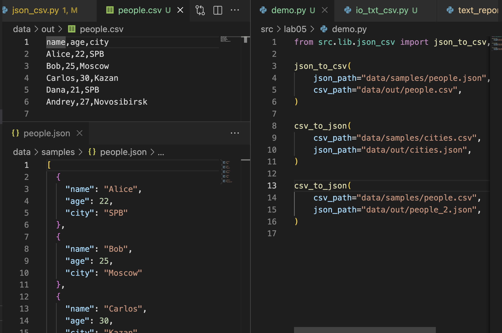

## Лабораторная работа 5

### Задание 1

```python
def json_to_csv(
    json_path: str | Path, csv_path: str | Path, encoding: str = "utf-8"
) -> None:
    """
    Преобразовать JSON-файл в CSV.

    Аргументы:
        json_path: путь к исходному JSON-файлу (строка или Path).
                   JSON должен быть списком словарей.
        csv_path: путь к создаваемому CSV-файлу (строка или Path).
        encoding: кодировка для чтения и записи файлов (по умолчанию "utf-8").

    Действие:
        - Читает JSON.
        - Определяет заголовки по ключам первого словаря.
        - Создаёт CSV с заголовком и строками из JSON.

    Падает с:
        FileNotFoundError: Если JSON-файл отсутствует.
        ValueError: Если JSON пустой, не является списком словарей
                    или имеет неподдерживаемую структуру.
                    Если JSON-файл содержит синтаксические ошибки.
    """

    json_path = Path(json_path)

    if not json_path.exists():
        raise FileNotFoundError(f"Файл {json_path} не найден")

    with json_path.open("r", encoding=encoding) as json_file:
        try:
            data_json = json.load(json_file)
        except json.JSONDecodeError:
            raise ValueError("Пустой JSON или неподдерживаемая структура")

    if not data_json or not isinstance(data_json, list):
        raise ValueError("Пустой JSON или неподдерживаемая структура")

    if not all(isinstance(row, dict) for row in data_json):
        raise ValueError("JSON должен содержать список словарей")

    csv_path = Path(csv_path)
    ensure_parent_dir(csv_path)
    with csv_path.open("w", newline="", encoding=encoding) as f:
        writer = csv.DictWriter(f, fieldnames=tuple(data_json[0].keys()))
        writer.writeheader()
        writer.writerows(data_json)
```



```python
def csv_to_json(
    csv_path: str | Path, json_path: str | Path, encoding: str = "utf-8"
) -> None:
    """
    Преобразовать CSV-файл в JSON.

    Аргументы:
        csv_path: путь к исходному CSV-файлу (строка или Path).
        json_path: путь к создаваемому JSON-файлу (строка или Path).
        encoding: кодировка для чтения и записи файлов (по умолчанию "utf-8").

    Действие:
        - Читает CSV с заголовком.
        - Преобразует строки CSV в список словарей.
        - Записывает JSON с отступами для удобного чтения.

    Падает с:
        FileNotFoundError: Если CSV-файл отсутствует.
        ValueError: Если CSV не содержит заголовков или пуст.
                    Если структура CSV-файла некорректна.
    """

    csv_path = Path(csv_path)

    if not csv_path.exists():
        raise FileNotFoundError(f"CSV-файл {csv_path} не найден")

    with csv_path.open("r", encoding=encoding) as csv_file:
        reader = csv.DictReader(csv_file)
        if not reader.fieldnames:
            raise ValueError("CSV-файл не содержит заголовков или пуст")
        data_csv = [row for row in reader]

    if not data_csv:
        raise ValueError("CSV-файл пуст")

    json_path = Path(json_path)
    ensure_parent_dir(json_path)
    with json_path.open("w", encoding=encoding) as json_file:
        json.dump(data_csv, json_file, indent=2)
```


### Задание 2

```python
from pathlib import Path
from src.lib.io_txt_csv import ensure_parent_dir, write_csv
import csv
from openpyxl import Workbook


def csv_to_xlsx(
    csv_path: str | Path,
    xlsx_path: str | Path,
    encoding: str = "utf-8",
) -> None:
    """
    Преобразует CSV-файл в Excel (XLSX) с проверкой структуры и корректности данных.

    CSV-файл должен содержать строку заголовков и хотя бы одну строку данных.
    Каждая колонка CSV будет перенесена в отдельный столбец листа Excel.

    Аргументы:
        csv_path: Путь к исходному CSV-файлу.
        xlsx_path: Путь к создаваемому XLSX-файлу.
        encoding: Кодировка файлов. По умолчанию "utf-8".

    Падает с:
        FileNotFoundError: Если CSV-файл отсутствует.
        ValueError: Если CSV не содержит заголовков или пуст.
                    Если структура CSV-файла некорректна.
    """

    csv_path = Path(csv_path)

    if not csv_path.exists():
        raise FileNotFoundError(f"CSV-файл {csv_path} не найден")

    wb = Workbook()
    ws = wb.active
    ws.title = "Sheet1"

    with csv_path.open("r", encoding=encoding) as csv_file:
        reader = csv.DictReader(csv_file)

        if not reader.fieldnames:
            raise ValueError("CSV без заголовков или пуст")

        ws.append(reader.fieldnames)

        for row in reader:
            ws.append([row[field] for field in reader.fieldnames])

    xlsx_path = Path(xlsx_path)
    ensure_parent_dir(xlsx_path)
    wb.save(xlsx_path)
```

